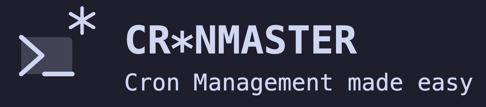
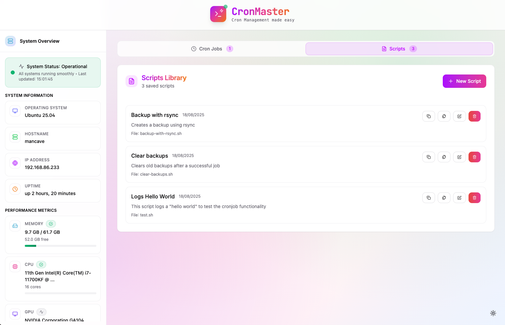

<p align="center">
  
</p>

## Features

- **Modern UI**: Beautiful, responsive interface with dark/light mode.
- **System Information**: Display hostname, IP address, uptime, memory, network and CPU info.
- **Cron Job Management**: View, create, and delete cron jobs with comments.
- **Script management**: View, create, and delete bash scripts on the go to use within your cron jobs.
- **Docker Support**: Runs entirely from a Docker container.
- **Easy Setup**: Quick presets for common cron schedules.

<br />

---

<p align="center">
  <a href="http://discord.gg/invite/mMuk2WzVZu">
    
  </a>
  <br />
  <i>Join the discord server for more info</i>
  <br />
</p>

---

<br />

## Before we start

Hey there! 👋 Just a friendly heads-up: I'm a big believer in open source and love sharing my work with the community. Everything you find in my GitHub repos is and always will be 100% free. If someone tries to sell you a "premium" version of any of my projects while claiming to be me, please know that this is not legitimate. 🚫

If you find my projects helpful and want to fuel my late-night coding sessions with caffeine, I'd be super grateful for any support! ☕

<p align="center">
  <a href="https://www.buymeacoffee.com/fccview">
    
  </a>
</p>

<div align="center">
  
  
</div>

## Quick Start

### Using Docker (Recommended)

1. Create a `docker-compose.yml` file with this content:

```bash
services:
  cronjob-manager:
    image: ghcr.io/fccview/cronmaster:latest
    container_name: cronmaster
    user: "root"
    ports:
      # Feel free to change port, 3000 is very common so I like to map it to something else
      - "40123:3000"
    environment:
      - NODE_ENV=production
      - DOCKER=true

      # --- MAP HOST PROJECT DIRECTORY, THIS IS MANDATORY FOR SCRIPTS TO WORK
      - HOST_PROJECT_DIR=/path/to/cronmaster/directory
      - NEXT_PUBLIC_CLOCK_UPDATE_INTERVAL=30000

      # --- PASSWORD PROTECTION
      # Uncomment to enable password protection (replace "very_strong_password" with your own)
      - AUTH_PASSWORD=very_strong_password

      # --- CRONTAB USERS
      # This is used to read the crontabs for the specific user.
      # replace root with your user - find it with: ls -asl /var/spool/cron/crontabs/
      # For multiple users, use comma-separated values: HOST_CRONTAB_USER=root,user1,user2
      - HOST_CRONTAB_USER=root
    volumes:
      # --- MOUNT DOCKER SOCKET
      # Mount Docker socket to execute commands on host
      - /var/run/docker.sock:/var/run/docker.sock

      # --- MOUNT DATA
      # These are needed if you want to keep your data on the host machine and not wihin the docker volume.
      # DO NOT change the location of ./scripts as all cronjobs that use custom scripts created via the app
      # will target this folder (thanks to the HOST_PROJECT_DIR variable set above)
      - ./scripts:/app/scripts
      - ./data:/app/data
      - ./snippets:/app/snippets

    # --- USE HOST PID NAMESPACE FOR HOST COMMAND EXECUTION
    # --- RUN IN PRIVILEGED MODE FOR NSENTER ACCESS
    pid: "host"
    privileged: true
    restart: always
    init: true

    # --- DEFAULT PLATFORM IS SET TO AMD64, UNCOMMENT TO USE ARM64.
    #platform: linux/arm64
```

### ARM64 Support

The application supports both AMD64 and ARM64 architectures:

**For AMD64 users**: No changes needed - the default configuration works out of the box.

**For ARM64 users**: Uncomment the platform line in your `docker-compose.yml`:

```yaml
platform: linux/arm64
```

**Note**: Multi-platform Docker images are automatically built for both architectures. The image will automatically use the correct architecture for your platform.

2. Build and run with Docker Compose:

```bash
docker compose up --build
```

3. Open your browser and navigate to `http://localhost:40123`

**Note**: The Docker implementation uses direct file access to read and write crontab files, ensuring real-time synchronization with the host system's cron jobs. This approach bypasses the traditional `crontab` command limitations in containerized environments

### Local Development

1. Install dependencies:

```bash
yarn install
```

2. Run the development server:

```bash
yarn dev
```

3. Open your browser and navigate to `http://localhost:3000`

### Environment Variables

The following environment variables can be configured:

| Variable                            | Default | Description                                                                                 |
| ----------------------------------- | ------- | ------------------------------------------------------------------------------------------- |
| `NEXT_PUBLIC_CLOCK_UPDATE_INTERVAL` | `30000` | Clock update interval in milliseconds (30 seconds)                                          |
| `HOST_PROJECT_DIR`                  | `N/A`   | Mandatory variable to make sure cron runs on the right path.                                |
| `DOCKER`                            | `false` | ONLY set this to true if you are runnign the app via docker, in the docker-compose.yml file |
| `HOST_CRONTAB_USER`                 | `root`  | Comma separated list of users that run cronjobs on your host machine                        |
| `AUTH_PASSWORD`                     | `N/A`   | If you set a password the application will be password protected with basic next-auth       |

**Example**: To change the clock update interval to 60 seconds:

```bash
NEXT_PUBLIC_CLOCK_UPDATE_INTERVAL=60000 docker-compose up
```

**Example**: Your `docker-compose.yml` file or repository are in `~/homelab/cronmaster/`

```bash
HOST_PROJECT_DIR=/home/<your_user_here>/homelab/cronmaster
```

### Important Notes for Docker

- Root user is required for cron operations and direct file access. There is no way around this, if you don't feel comfortable in running it as root feel free to run the app locally with `yarn install`, `yarn build` and `yarn start`
- `HOST_PROJECT_DIR` is required in order for the scripts created within the app to run properly
- The `DOCKER=true` environment variable enables direct file access mode for crontab operations. This is REQUIRED when running the application in docker mode.

**Please Note**: If you want to run `docker compose` commands as `root` within your cron jobs (highly discouraged btw), you will need to install Docker with root privileges. Otherwise, `docker compose` won't be found when executing commands.

## Usage

### Viewing System Information

The application automatically detects your operating system and displays:

- System Uptime
- Memory Usage
- CPU Information
- GPU Information (if supported)

### Managing Cron Jobs

1. **View Existing Jobs**: All current cron jobs are displayed with their schedules and commands
2. **Create New Jobs**: Use the form on the right side to create new cron jobs
3. **Quick Presets**: Click on preset buttons for common schedules
4. **Add Comments**: Include descriptions for your cron jobs
5. **Delete Jobs**: Remove unwanted cron jobs with the delete button
6. **Clone Jobs**: Clone jobs to quickly edit the command in case it's similar

### Cron Schedule Format

The application uses standard cron format: `* * * * *`

- First field: Minute (0-59)
- Second field: Hour (0-23)
- Third field: Day of month (1-31)
- Fourth field: Month (1-12)
- Fifth field: Day of week (0-7, where 0 and 7 are Sunday)

### Managing Scripts

1. **View Existing Scripts**: All current user created scripts are displayed with their name and descriptions
2. **Create New Script**: Use the editor and snippets to quickly create scripts for your cron jobs.
3. **Quick Snippets**: Pre-set of snippets, with ability to add new ones. Check README.md in [Snippets](snippets/README.md)
4. **Delete Scripts**: Remove unwanted scripts (this won't delete the cronjob, you will need to manually remove these yourself)
5. **Clone Scripts**: Clone scripts to quickly edit them in case they are similar to one another.

## Technologies Used

- **Next.js 14**: React framework with App Router
- **TypeScript**: Type-safe JavaScript
- **Tailwind CSS**: Utility-first CSS framework
- **Lucide React**: Beautiful icons
- **next-themes**: Dark/light mode support
- **Docker**: Containerization

## Contributing

1. Fork the repository
2. Create a feature branch
3. Make your changes
4. Add tests if applicable
5. Submit a pull request

## Community shouts

I would like to thank the following members for raising issues and help test/debug them!

<table>
  <tbody>
    <tr>
      <td align="center" valign="top" width="20%">
        <a href="https://github.com/hermannx5"><br/>hermannx5</a>
      </td>
      <td align="center" valign="top" width="20%">
        <a href="https://github.com/edersong"><br />edersong</a>
      </td>
      <td align="center" valign="top" width="20%">
        <a href="https://github.com/corasaniti"><br />corasaniti</a>
      </td>
      <td align="center" valign="top" width="20%">
        <a href="https://github.com/abhisheknair"><br />abhisheknair</a>
      </td>
      <td align="center" valign="top" width="20%">
        <a href="https://github.com/mariushosting"><br />mariushosting</a>
      </td>
    </tr>
    <tr>
      <td align="center" valign="top" width="20%">
        <a href="https://github.com/DVDAndroid"><br />DVDAndroid</a>
      </td>
      <td align="center" valign="top" width="20%">
        <a href="https://github.com/ActxLeToucan"><br />ActxLeToucan</a>
      </td>
      <td align="center" valign="top" width="20%">
        <a href="https://github.com/mrtimothyduong"><br />mrtimothyduong</a>
      </td>
      <td align="center" valign="top" width="20%">
        <a href="https://github.com/cerede2000"><br />cerede2000</a>
      </td>
      <td align="center" valign="top" width="20%">
        <a href="https://github.com/Navino16"><br />Navino16</a>
      </td>
    </tr>
  </tbody>
</table>

## License

This project is licensed under the MIT License.

## Support

For issues and questions, please open an issue on the GitHub repository.

## Star History

[](https://www.star-history.com/#fccview/cronmaster&Date)
