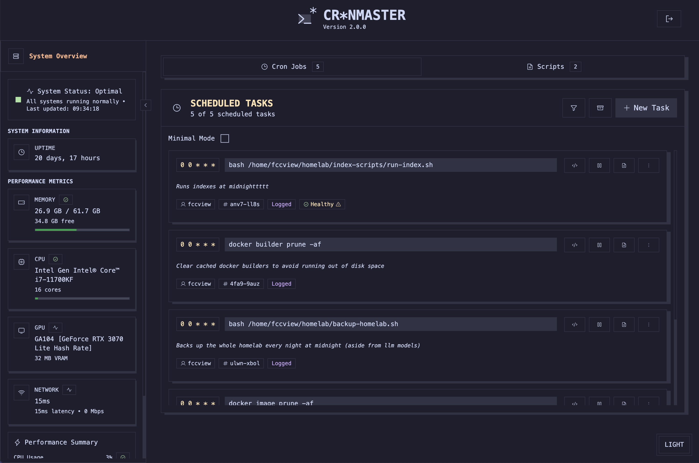
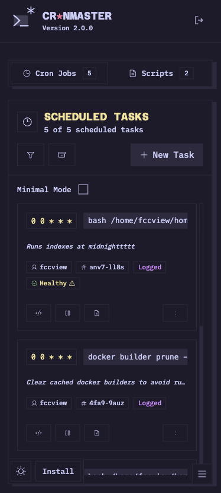
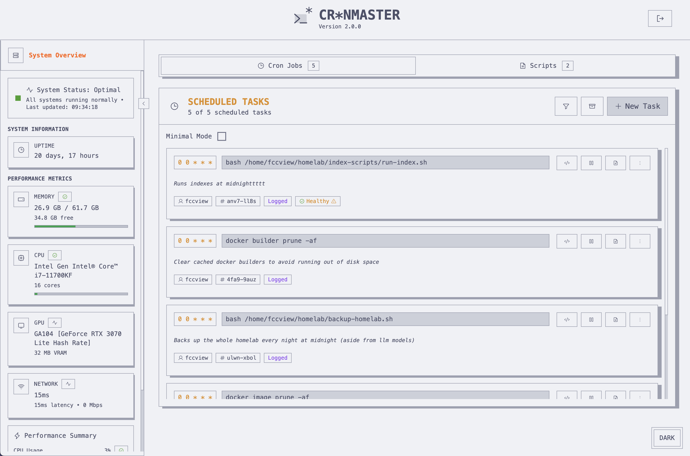
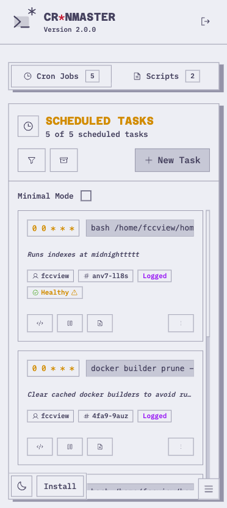

<p align="center">
  
</p>

## Quick links

- [Features](#features)
- [Quick Start](#quick-start)
  - [Using Docker (Recommended)](#using-docker-recommended)
  - [API](#api)
  - [Single Sign-On (SSO) with OIDC](#single-sign-on-sso-with-oidc)
  - [Localization](#localization)
  - [Local Development](#local-development)
  - [Environment Variables](howto/ENV_VARIABLES.md)
- [Authentication](#authentication)
- [Usage](#usage)
  - [Viewing System Information](#viewing-system-information)
  - [Managing Cron Jobs](#managing-cron-jobs)
  - [Job Execution Logging](#job-execution-logging)
  - [Managing Scripts](#managing-scripts)


<div align="center">

| Desktop | Mobile |
|---------|--------|
|  |  |
|  |  |

</div>

## Features

- **Modern UI**: Beautiful, responsive interface with dark/light mode.
- **System Information**: Display uptime, memory, network, CPU, and GPU info.
- **Cron Job Management**: View, create, and delete cron jobs with comments.
- **Script management**: View, create, and delete bash scripts on the go to use within your cron jobs.
- **Job Execution Logging**: Optional logging for cronjobs with automatic cleanup, capturing stdout, stderr, exit codes, and timestamps.
- **Live Updates (SSE)**: Real-time job status updates and live log streaming for long-running jobs (when logging is enabled).
- **Smart Job Execution**: Jobs with logging run in background with live updates, jobs without logging run synchronously with 5-minute timeout.
- **Authentication**: Secure password-based and/or OIDC (SSO) authentication with proper session management.
- **REST API**: Full REST API with optional API key authentication for external integrations.
- **Docker Support**: Runs entirely from a Docker container.
- **Easy Setup**: Quick presets for common cron schedules.

<br />

---

<p align="center">
  <a href="http://discord.gg/invite/mMuk2WzVZu">
    
  </a>
  <br />
  <i>Join the discord server for more info</i>
  <br />
</p>

<p align="center">
  <a href="https://www.buymeacoffee.com/fccview">
    
  </a>
</p>

---

<a id="quick-start"></a>

## Quick Start

<a id="using-docker-recommended"></a>

### Using Docker (Recommended)

1. Create a `docker-compose.yml` file with this minimal configuration:

```yaml
# For all configuration options, see howto/DOCKER.md
services:
  cronmaster:
    image: ghcr.io/fccview/cronmaster:latest
    container_name: cronmaster
    user: "root"
    ports:
      - "40123:3000"
    environment:
      - NODE_ENV=production
      - NEXT_PUBLIC_CLOCK_UPDATE_INTERVAL=30000
      - AUTH_PASSWORD=very_strong_password
      - HOST_CRONTAB_USER=root
    volumes:
      - /var/run/docker.sock:/var/run/docker.sock
      - ./scripts:/app/scripts
      - ./data:/app/data
      - ./snippets:/app/snippets
    pid: "host"
    privileged: true
    restart: always
    init: true
```

📖 **For all available configuration options, see [`howto/DOCKER.md`](howto/DOCKER.md)**

<a id="api"></a>

## API

`cr*nmaster` includes a REST API for programmatic access to your cron jobs and system information. This is perfect for integrations.

📖 **For the complete API documentation, see [howto/API.md](howto/API.md)**

<a id="single-sign-on-sso-with-oidc"></a>

## Single Sign-On (SSO) with OIDC

`cr*nmaster` supports any OIDC provider (Authentik, Auth0, Keycloak, Okta, Google, EntraID, etc.)

📖 **For the complete SSO documentation, see [howto/SSO.md](howto/SSO.md)**

<a id="localization"></a>

## Localization

`cr*nmaster` officially support [some languages](app/_translations) and allows you to create your custom translations locally on your own machine.

📖 **For the complete Translations documentation, see [howto/TRANSLATIONS.md](howto/TRANSLATIONS.md)**

### ARM64 Support

The application supports both AMD64 and ARM64 architectures:

**For AMD64 users**: No changes needed - the default configuration works out of the box.

**For ARM64 users**: Uncomment the platform line in your `docker-compose.yml`:

```yaml
platform: linux/arm64
```

**Note**: Multi-platform Docker images are automatically built for both architectures. The image will automatically use the correct architecture for your platform.

2. Build and run with Docker Compose:

```bash
docker compose up --build
```

3. Open your browser and navigate to `http://localhost:40123`

**Note**: The Docker implementation uses direct file access to read and write crontab files, ensuring real-time synchronization with the host system's cron jobs. This approach bypasses the traditional `crontab` command limitations in containerized environments

<a id="local-development"></a>

### Local Development

1. Install dependencies:

```bash
yarn install
```

2. Run the development server:

```bash
yarn dev
```

3. Open your browser and navigate to `http://localhost:3000`

<a id="environment-variables"></a>

### Environment Variables

📖 **For the complete environment variables reference, see [`howto/ENV_VARIABLES.md`](howto/ENV_VARIABLES.md)**

This includes all configuration options for:

- Core application settings
- Docker configuration
- UI customization
- Logging settings
- Authentication (password, SSO/OIDC, API keys)
- Development and debugging options

### Important Notes for Docker

- Root user is required for cron operations and direct file access. There is no way around this, if you don't feel comfortable in running it as root feel free to run the app locally with `yarn install`, `yarn build` and `yarn start`
- The `DOCKER=true` environment variable enables direct file access mode for crontab operations. This is REQUIRED when running the application in docker mode.
- The Docker socket and data volume mounts are required for proper functionality

**Important Note on Root Commands**: When running commands as `root` within Cronmaster, ensure that these commands also function correctly as `root` on your host machine. If a command works as `root` on your host but fails within Cronmaster, please open an issue with detailed information.

<a id="authentication"></a>

## Authentication

Cr\*nMaster supports multiple authentication methods to secure your instance:

### Password Authentication

Set a password to protect access to your Cronmaster instance:

```yaml
environment:
  - AUTH_PASSWORD=your_secure_password
```

Users will be prompted to enter this password before accessing the application.

### SSO Authentication (OIDC)

Cr\*nMaster supports SSO via OIDC (OpenID Connect), compatible with providers like:

- Authentik
- Auth0
- Keycloak
- Okta
- Google
- Entra ID (Azure AD)
- And many more!

You can enable **both** password and SSO authentication simultaneously:

The login page will display both options, allowing users to choose their preferred method.

**For detailed setup instructions, see **[howto/SSO.md](howto/SSO.md)**

<a id="usage"></a>

## Usage

<a id="viewing-system-information"></a>

### Viewing System Information

The application automatically detects your operating system and displays:

- System Uptime
- Memory Usage
- CPU Information
- GPU Information (if supported)

<a id="managing-cron-jobs"></a>

### Managing Cron Jobs

1. **View Existing Jobs**: All current cron jobs are displayed with their schedules and commands
2. **Create New Jobs**: Use the form on the right side to create new cron jobs
3. **Quick Presets**: Click on preset buttons for common schedules
4. **Add Comments**: Include descriptions for your cron jobs
5. **Delete Jobs**: Remove unwanted cron jobs with the delete button
6. **Clone Jobs**: Clone jobs to quickly edit the command in case it's similar
7. **Enable Logging**: Optionally enable execution logging for any cronjob to capture detailed execution information

<a id="job-execution-logging"></a>

### Job Execution Logging

📖 **For complete logging documentation, see [howto/LOGS.md](howto/LOGS.md)**

### Cron Schedule Format

The application uses standard cron format: `* * * * *`

- First field: Minute (0-59)
- Second field: Hour (0-23)
- Third field: Day of month (1-31)
- Fourth field: Month (1-12)
- Fifth field: Day of week (0-7, where 0 and 7 are Sunday)

<a id="managing-scripts"></a>

### Managing Scripts

1. **View Existing Scripts**: All current user created scripts are displayed with their name and descriptions
2. **Create New Script**: Use the editor and snippets to quickly create scripts for your cron jobs.
3. **Quick Snippets**: Pre-set of snippets, with ability to add new ones. Check README.md in [Snippets](snippets/README.md)
4. **Delete Scripts**: Remove unwanted scripts (this won't delete the cronjob, you will need to manually remove these yourself)
5. **Clone Scripts**: Clone scripts to quickly edit them in case they are similar to one another.

## Community shouts

I would like to thank the following members for raising issues and help test/debug them!

<table>
  <tbody>
    <tr>
      <td align="center" valign="top" width="20%">
        <a href="https://github.com/hermannx5"><br/>hermannx5</a>
      </td>
      <td align="center" valign="top" width="20%">
        <a href="https://github.com/edersong"><br />edersong</a>
      </td>
      <td align="center" valign="top" width="20%">
        <a href="https://github.com/corasaniti"><br />corasaniti</a>
      </td>
      <td align="center" valign="top" width="20%">
        <a href="https://github.com/abhisheknair"><br />abhisheknair</a>
      </td>
      <td align="center" valign="top" width="20%">
        <a href="https://github.com/mariushosting"><br />mariushosting</a>
      </td>
    </tr>
    <tr>
      <td align="center" valign="top" width="20%">
        <a href="https://github.com/DVDAndroid"><br />DVDAndroid</a>
      </td>
      <td align="center" valign="top" width="20%">
        <a href="https://github.com/ActxLeToucan"><br />ActxLeToucan</a>
      </td>
      <td align="center" valign="top" width="20%">
        <a href="https://github.com/mrtimothyduong"><br />mrtimothyduong</a>
      </td>
      <td align="center" valign="top" width="20%">
        <a href="https://github.com/cerede2000"><br />cerede2000</a>
      </td>
      <td align="center" valign="top" width="20%">
        <a href="https://github.com/Navino16"><br />Navino16</a>
      </td>
    </tr>
    <tr>
      <td align="center" valign="top" width="20%">
        <a href="https://github.com/ShadowTox"><br />ShadowTox</a>
      </td>
    </tr>
  </tbody>
</table>

## Star History

[](https://www.star-history.com/#fccview/cronmaster&Date)
