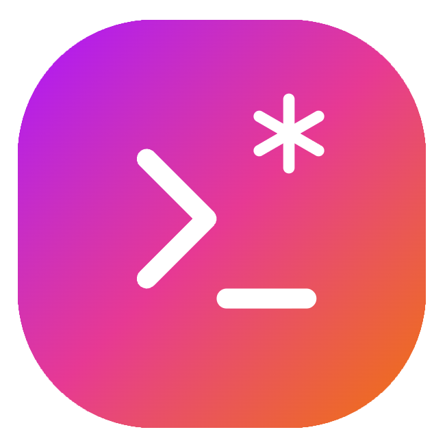

<p align="center">
  <h1 align="center">
    
    <div>
      Chr*nMaster
    </div>
  </h1>
</p>

<p align="center">
  <strong>A modern, web-based interface for managing cron jobs.</strong>
</p>

<p align="center">
  Built with Next.js, TypeScript, and Tailwind CSS.
</p>

<p align="center">
  <a href="https://www.buymeacoffee.com/fccview">
    
  </a>
</p>

<div align="center">
  
  
</div>

## Features

- **Modern UI**: Beautiful, responsive interface with dark/light mode.
- **System Information**: Display hostname, IP address, uptime, memory, network and CPU info.
- **Cron Job Management**: View, create, and delete cron jobs with comments.
- **Script management**: View, create, and delete bash scripts on the go to use within your cron jobs.
- **Docker Support**: Runs entirely from a Docker container.
- **Easy Setup**: Quick presets for common cron schedules.

## Quick Start

### Using Docker (Recommended)

1. Create a `docker-compose.yml` file with this content:

```bash
services:
  cronjob-manager:
    image: ghcr.io/fccview/cronmaster:main
    container_name: chronmaster
    user: "root"
    ports:
      # Mapping custom port 40123 due to 3000 being very common
      - "40123:3000"
    environment:
      - NODE_ENV=production
      - NEXT_PUBLIC_CLOCK_UPDATE_INTERVAL=30000
      # Enter the FULL relative path to the project directory where this docker-compose.yml file is located (use `pwd` to find it)
      - NEXT_PUBLIC_HOST_PROJECT_DIR=/absolute/path/to/project/directory
    volumes:
      # Mount the host's crontab for Linux/Unix systems
      - /var/spool/cron/crontabs:/var/spool/cron/crontabs:ro
      - /etc/crontab:/etc/crontab:ro
      # Mount system information directories
      - /proc:/proc:ro
      - /sys:/sys:ro
      - /etc:/etc:ro
      # Mount scripts directory for script execution
      - ${NEXT_PUBLIC_HOST_PROJECT_DIR}/scripts:/app/scripts
      # Mount data directory for persistence
      - ${NEXT_PUBLIC_HOST_PROJECT_DIR}/data:/app/data
      # Mount snippets directory for user-defined snippets
      - ${NEXT_PUBLIC_HOST_PROJECT_DIR}/snippets:/app/snippets
    # Run with host network to access system information
    network_mode: host
    # Run as root to access system commands (needed for cron operations)
    user: root
    restart: unless-stopped
    security_opt:
      - no-new-privileges:true
    cap_add:
      - SYS_ADMIN
    cap_drop:
      - ALL
```

2. Build and run with Docker Compose:

```bash
docker compose up --build
```

3. Open your browser and navigate to `http://localhost:40123`

### Local Development

1. Install dependencies:

```bash
yarn install
```

2. Run the development server:

```bash
yarn dev
```

3. Open your browser and navigate to `http://localhost:3000`

### Environment Variables

The following environment variables can be configured:

| Variable                            | Default | Description                                                  |
| ----------------------------------- | ------- | ------------------------------------------------------------ |
| `NEXT_PUBLIC_CLOCK_UPDATE_INTERVAL` | `30000` | Clock update interval in milliseconds (30 seconds)           |
| `NEXT_PUBLIC_HOST_PROJECT_DIR`      | `N/A`   | Mandatory variable to make sure cron runs on the right path. |

**Example**: To change the clock update interval to 60 seconds:

```bash
NEXT_PUBLIC_CLOCK_UPDATE_INTERVAL=60000 docker-compose up
```

### Important Notes for Docker

- The container runs with `network_mode: host` to access system information
- Root user is required for cron operations
- System directories are mounted as read-only for security
- `NEXT_PUBLIC_HOST_PROJECT_DIR` is required in order for the scripts created within the app to run properly.

## Usage

### Viewing System Information

The application automatically detects your operating system and displays:

- Platform (Linux/macOS/Windows - not supported)
- Hostname
- IP Address
- System Uptime
- Memory Usage
- CPU Information

### Managing Cron Jobs

1. **View Existing Jobs**: All current cron jobs are displayed with their schedules and commands
2. **Create New Jobs**: Use the form on the right side to create new cron jobs
3. **Quick Presets**: Click on preset buttons for common schedules
4. **Add Comments**: Include descriptions for your cron jobs
5. **Delete Jobs**: Remove unwanted cron jobs with the delete button
6. **Clone Jobs**: Clone jobs to quickly edit the command in case it's similar

### Cron Schedule Format

The application uses standard cron format: `* * * * *`

- First field: Minute (0-59)
- Second field: Hour (0-23)
- Third field: Day of month (1-31)
- Fourth field: Month (1-12)
- Fifth field: Day of week (0-7, where 0 and 7 are Sunday)

### Managing Scripts

1. **View Existing Scripts**: All current user created scripts are displayed with their name and descriptions
2. **Create New Script**: Use the editor and snippets to quickly create scripts for your cron jobs.
3. **Quick Snippets**: Pre-set of snippets, with ability to add new ones. Check README.md in `./snippets`
4. **Delete Scripts**: Remove unwanted scripts (this won't delete the cronjob, you will need to manually remove these yourself)
5. **Clone Scripts**: Clone scripts to quickly edit them in case they are similar to one another.

## Technologies Used

- **Next.js 14**: React framework with App Router
- **TypeScript**: Type-safe JavaScript
- **Tailwind CSS**: Utility-first CSS framework
- **Lucide React**: Beautiful icons
- **next-themes**: Dark/light mode support
- **Docker**: Containerization

## Security Considerations

- The application requires root access for cron operations
- System directories are mounted as read-only
- Input validation is implemented for all user inputs

## Contributing

1. Fork the repository
2. Create a feature branch
3. Make your changes
4. Add tests if applicable
5. Submit a pull request

## License

This project is licensed under the MIT License.

## Support

For issues and questions, please open an issue on the GitHub repository.
