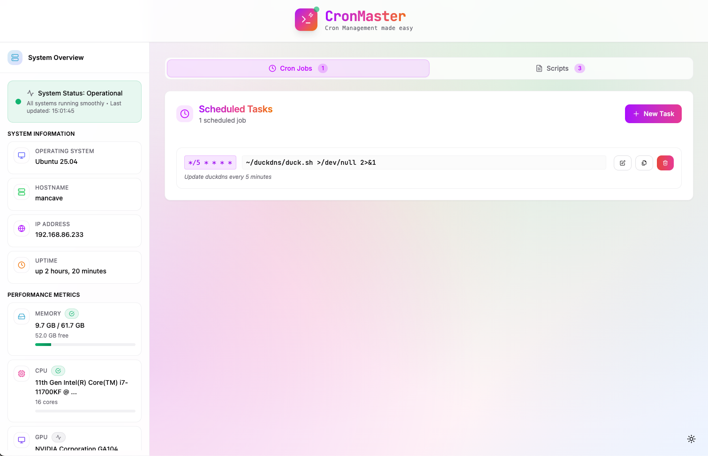

<p align="center">
  
</p>

## Features

- **Modern UI**: Beautiful, responsive interface with dark/light mode.
- **System Information**: Display hostname, IP address, uptime, memory, network and CPU info.
- **Cron Job Management**: View, create, and delete cron jobs with comments.
- **Script management**: View, create, and delete bash scripts on the go to use within your cron jobs.
- **Job Execution Logging**: Optional logging for cronjobs with automatic cleanup, capturing stdout, stderr, exit codes, and timestamps.
- **Live Updates (SSE)**: Real-time job status updates and live log streaming for long-running jobs (when logging is enabled).
- **Smart Job Execution**: Jobs with logging run in background with live updates, jobs without logging run synchronously with 5-minute timeout.
- **Docker Support**: Runs entirely from a Docker container.
- **Easy Setup**: Quick presets for common cron schedules.

<br />

---

<p align="center">
  <a href="http://discord.gg/invite/mMuk2WzVZu">
    
  </a>
  <br />
  <i>Join the discord server for more info</i>
  <br />
</p>

---

<br />

## Before we start

Hey there! 👋 Just a friendly heads-up: I'm a big believer in open source and love sharing my work with the community. Everything you find in my GitHub repos is and always will be 100% free. If someone tries to sell you a "premium" version of any of my projects while claiming to be me, please know that this is not legitimate. 🚫

If you find my projects helpful and want to fuel my late-night coding sessions with caffeine, I'd be super grateful for any support! ☕

<p align="center">
  <a href="https://www.buymeacoffee.com/fccview">
    
  </a>
</p>

<div align="center">
  
  
</div>

## Quick Start

### Using Docker (Recommended)

1. Create a `docker-compose.yml` file with this content:

```bash
services:
  cronmaster:
    image: ghcr.io/fccview/cronmaster:latest
    container_name: cronmaster
    user: "root"
    ports:
      # Feel free to change port, 3000 is very common so I like to map it to something else
      - "40123:3000"
    environment:
      - NODE_ENV=production
      - DOCKER=true
      - NEXT_PUBLIC_CLOCK_UPDATE_INTERVAL=30000

      # --- SET LOCALE TO ONE OF OUR SUPPORTED LOCALES - see the /app/_translations/ folder for supported locales
      # - LOCALE=en

      # --- UNCOMMENT TO SET DIFFERENT LOGGING VALUES
      # - MAX_LOG_AGE_DAYS=30
      # - MAX_LOGS_PER_JOB=50

      # --- PASSWORD PROTECTION
      # Uncomment to enable password protection (replace "password" with your own)
      - AUTH_PASSWORD=very_strong_password

      # --- LIVE UPDATES (SSE)
      # Set to false to disable live updates via Server-Sent Events
      # - LIVE_UPDATES=false

      # --- CRONTAB USERS
      # This is used to read the crontabs for the specific user.
      # replace root with your user - find it with: ls -asl /var/spool/cron/crontabs/
      # For multiple users, use comma-separated values: HOST_CRONTAB_USER=root,user1,user2
      - HOST_CRONTAB_USER=root
    volumes:
      # --- MOUNT DOCKER SOCKET
      # Mount Docker socket to execute commands on host
      - /var/run/docker.sock:/var/run/docker.sock

      # --- MOUNT DATA
      # These are needed if you want to keep your data on the host machine and not wihin the docker volume.
      # DO NOT change the location of ./scripts once you create crons as all cronjobs that use custom
      # scripts created via the app will target this folder
      - ./scripts:/app/scripts
      - ./data:/app/data
      - ./snippets:/app/snippets

    # --- USE HOST PID NAMESPACE FOR HOST COMMAND EXECUTION
    # --- RUN IN PRIVILEGED MODE FOR NSENTER ACCESS
    pid: "host"
    privileged: true
    restart: always
    init: true

    # --- DEFAULT PLATFORM IS SET TO AMD64, UNCOMMENT TO USE ARM64.
    #platform: linux/arm64
```

### ARM64 Support

The application supports both AMD64 and ARM64 architectures:

**For AMD64 users**: No changes needed - the default configuration works out of the box.

**For ARM64 users**: Uncomment the platform line in your `docker-compose.yml`:

```yaml
platform: linux/arm64
```

**Note**: Multi-platform Docker images are automatically built for both architectures. The image will automatically use the correct architecture for your platform.

2. Build and run with Docker Compose:

```bash
docker compose up --build
```

3. Open your browser and navigate to `http://localhost:40123`

**Note**: The Docker implementation uses direct file access to read and write crontab files, ensuring real-time synchronization with the host system's cron jobs. This approach bypasses the traditional `crontab` command limitations in containerized environments

### Local Development

1. Install dependencies:

```bash
yarn install
```

2. Run the development server:

```bash
yarn dev
```

3. Open your browser and navigate to `http://localhost:3000`

### Environment Variables

The following environment variables can be configured:

| Variable                            | Default | Description                                                                                 |
| ----------------------------------- | ------- | ------------------------------------------------------------------------------------------- |
| `NEXT_PUBLIC_CLOCK_UPDATE_INTERVAL` | `30000` | Clock update interval in milliseconds (30 seconds)                                          |
| `HOST_PROJECT_DIR`                  | `N/A`   | Mandatory variable to make sure cron runs on the right path.                                |
| `DOCKER`                            | `false` | ONLY set this to true if you are runnign the app via docker, in the docker-compose.yml file |
| `HOST_CRONTAB_USER`                 | `root`  | Comma separated list of users that run cronjobs on your host machine                        |
| `AUTH_PASSWORD`                     | `N/A`   | If you set a password the application will be password protected with basic next-auth       |
| `HOME`                              | `N/A`   | Optional path to your home folder, defaults to `/home`                                      |


### Important Notes for Docker

- Root user is required for cron operations and direct file access. There is no way around this, if you don't feel comfortable in running it as root feel free to run the app locally with `yarn install`, `yarn build` and `yarn start`
- `HOST_PROJECT_DIR` is required in order for the scripts created within the app to run properly
- The `DOCKER=true` environment variable enables direct file access mode for crontab operations. This is REQUIRED when running the application in docker mode.

**Important Note on Root Commands**: When running commands as `root` within Cronmaster, ensure that these commands also function correctly as `root` on your host machine. If a command works as `root` on your host but fails within Cronmaster, please open an issue with detailed information.

## Usage

### Viewing System Information

The application automatically detects your operating system and displays:

- System Uptime
- Memory Usage
- CPU Information
- GPU Information (if supported)

### Managing Cron Jobs

1. **View Existing Jobs**: All current cron jobs are displayed with their schedules and commands
2. **Create New Jobs**: Use the form on the right side to create new cron jobs
3. **Quick Presets**: Click on preset buttons for common schedules
4. **Add Comments**: Include descriptions for your cron jobs
5. **Delete Jobs**: Remove unwanted cron jobs with the delete button
6. **Clone Jobs**: Clone jobs to quickly edit the command in case it's similar
7. **Enable Logging**: Optionally enable execution logging for any cronjob to capture detailed execution information

### Job Execution Logging

CronMaster includes an optional logging feature that captures detailed execution information for your cronjobs:

#### How It Works

When you enable logging for a cronjob, CronMaster automatically wraps your command with a log wrapper script. This wrapper:

- Captures **stdout** and **stderr** output
- Records the **exit code** of your command
- Timestamps the **start and end** of execution
- Calculates **execution duration**
- Stores all this information in organized log files

#### Enabling Logs

1. When creating or editing a cronjob, check the "Enable Logging" checkbox
2. The wrapper is automatically added to your crontab entry
3. Jobs run independently - they continue to work even if CronMaster is offline

#### Log Storage

Logs are stored in the `./data/logs/` directory with descriptive folder names:

- If a job has a **description/comment**: `{sanitized-description}_{jobId}/`
- If a job has **no description**: `{jobId}/`

Example structure:

```
./data/logs/
├── backup-database_root-0/
│   ├── 2025-11-10_14-30-00.log
│   ├── 2025-11-10_15-30-00.log
│   └── 2025-11-10_16-30-00.log
├── daily-cleanup_root-1/
│   └── 2025-11-10_14-35-00.log
├── root-2/  (no description provided)
│   └── 2025-11-10_14-40-00.log
```

**Note**: Folder names are sanitized to be filesystem-safe (lowercase, alphanumeric with hyphens, max 50 chars for the description part).

#### Log Format

Each log file includes:

```
==========================================
=== CronMaster Job Execution Log ===
==========================================
Log Folder: backup-database_root-0
Command: bash /app/scripts/backup.sh
Started: 2025-11-10 14:30:00
==========================================

[command output here]

==========================================
=== Execution Summary ===
==========================================
Completed: 2025-11-10 14:30:45
Duration: 45 seconds
Exit code: 0
==========================================
```

#### Automatic Cleanup

Logs are automatically cleaned up to prevent disk space issues:

- **Maximum logs per job**: 50 log files
- **Maximum age**: 30 days
- **Cleanup trigger**: When viewing logs or after manual execution
- **Method**: Oldest logs are deleted first when limits are exceeded

#### Custom Wrapper Script

You can override the default log wrapper by creating your own at `./data/wrapper-override.sh`. This allows you to:

- Customize log format
- Add additional metadata
- Integrate with external logging services
- Implement custom retention policies

**Example custom wrapper**:

```bash
#!/bin/bash
JOB_ID="$1"
shift

# Your custom logic here
LOG_FILE="/custom/path/${JOB_ID}_$(date '+%Y%m%d').log"

{
  echo "=== Custom Log Format ==="
  echo "Job: $JOB_ID"
  "$@"
  echo "Exit: $?"
} >> "$LOG_FILE" 2>&1
```

#### Docker Considerations

- Mount the `./data` directory to persist logs on the host
- The wrapper script location: `./data/cron-log-wrapper.sh`. This will be generated automatically the first time you enable logging.

#### Non-Docker Considerations

- Logs are stored at `./data/logs/` relative to the project directory
- The codebase wrapper script location: `./app/_scripts/cron-log-wrapper.sh`
- The running wrapper script location: `./data/cron-log-wrapper.sh`

#### Important Notes

- Logging is **optional** and disabled by default
- Jobs with logging enabled are marked with a blue "Logged" badge in the UI
- Logs are captured for both scheduled runs and manual executions
- Commands with file redirections (>, >>) may conflict with logging
- The crontab stores the **wrapped command**, so jobs run independently of CronMaster

### Cron Schedule Format

The application uses standard cron format: `* * * * *`

- First field: Minute (0-59)
- Second field: Hour (0-23)
- Third field: Day of month (1-31)
- Fourth field: Month (1-12)
- Fifth field: Day of week (0-7, where 0 and 7 are Sunday)

### Managing Scripts

1. **View Existing Scripts**: All current user created scripts are displayed with their name and descriptions
2. **Create New Script**: Use the editor and snippets to quickly create scripts for your cron jobs.
3. **Quick Snippets**: Pre-set of snippets, with ability to add new ones. Check README.md in [Snippets](snippets/README.md)
4. **Delete Scripts**: Remove unwanted scripts (this won't delete the cronjob, you will need to manually remove these yourself)
5. **Clone Scripts**: Clone scripts to quickly edit them in case they are similar to one another.

## Technologies Used

- **Next.js 14**: React framework with App Router
- **TypeScript**: Type-safe JavaScript
- **Tailwind CSS**: Utility-first CSS framework
- **Lucide React**: Beautiful icons
- **next-themes**: Dark/light mode support
- **Docker**: Containerization

## Contributing

1. Fork the repository
2. Create a feature branch
3. Make your changes
4. Add tests if applicable
5. Submit a pull request

## Community shouts

I would like to thank the following members for raising issues and help test/debug them!

<table>
  <tbody>
    <tr>
      <td align="center" valign="top" width="20%">
        <a href="https://github.com/hermannx5"><br/>hermannx5</a>
      </td>
      <td align="center" valign="top" width="20%">
        <a href="https://github.com/edersong"><br />edersong</a>
      </td>
      <td align="center" valign="top" width="20%">
        <a href="https://github.com/corasaniti"><br />corasaniti</a>
      </td>
      <td align="center" valign="top" width="20%">
        <a href="https://github.com/abhisheknair"><br />abhisheknair</a>
      </td>
      <td align="center" valign="top" width="20%">
        <a href="https://github.com/mariushosting"><br />mariushosting</a>
      </td>
    </tr>
    <tr>
      <td align="center" valign="top" width="20%">
        <a href="https://github.com/DVDAndroid"><br />DVDAndroid</a>
      </td>
      <td align="center" valign="top" width="20%">
        <a href="https://github.com/ActxLeToucan"><br />ActxLeToucan</a>
      </td>
      <td align="center" valign="top" width="20%">
        <a href="https://github.com/mrtimothyduong"><br />mrtimothyduong</a>
      </td>
      <td align="center" valign="top" width="20%">
        <a href="https://github.com/cerede2000"><br />cerede2000</a>
      </td>
      <td align="center" valign="top" width="20%">
        <a href="https://github.com/Navino16"><br />Navino16</a>
      </td>
    </tr>
  </tbody>
</table>

## License

This project is licensed under the MIT License.

## Support

For issues and questions, please open an issue on the GitHub repository.

## Star History

[](https://www.star-history.com/#fccview/cronmaster&Date)
