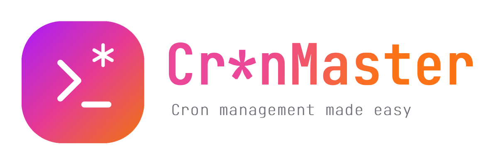

<p align="center">
  
</p>

## Features

- **Modern UI**: Beautiful, responsive interface with dark/light mode.
- **System Information**: Display hostname, IP address, uptime, memory, network and CPU info.
- **Cron Job Management**: View, create, and delete cron jobs with comments.
- **Script management**: View, create, and delete bash scripts on the go to use within your cron jobs.
- **Docker Support**: Runs entirely from a Docker container.
- **Easy Setup**: Quick presets for common cron schedules.

## Before we start

Hey there! 👋 Just a friendly heads-up: I'm a big believer in open source and love sharing my work with the community. Everything you find in my GitHub repos is and always will be 100% free. If someone tries to sell you a "premium" version of any of my projects while claiming to be me, please know that this is not legitimate. 🚫

If you find my projects helpful and want to fuel my late-night coding sessions with caffeine, I'd be super grateful for any support! ☕

<p align="center">
  <a href="https://www.buymeacoffee.com/fccview">
    
  </a>
</p>

<div align="center">
  
  
</div>

## Quick Start

### Using Docker (Recommended)

1. Create a `docker-compose.yml` file with this content:

```bash
services:
  cronjob-manager:
    image: ghcr.io/fccview/cronmaster:main
    container_name: cronmaster
    user: "root"
    network_mode: host
    pid: "host"
    environment:
      - NODE_ENV=production
      - DOCKER=true
      - NEXT_PUBLIC_CLOCK_UPDATE_INTERVAL=30000
      # Feel free to change port, as we're running this as host you won't be able to externally map it
      - PORT=40123
      # Enter the FULL relative path to the project directory where this docker-compose.yml file is located (use `pwd` to find it)
      - NEXT_PUBLIC_HOST_PROJECT_DIR=/path/to/cronmaster/directory
    volumes:
      # Mount the host's crontab for Linux/Unix systems
      - /var/spool/cron/crontabs:/host/cron/crontabs
      - /etc/crontab:/host/crontab:ro
      # Mount system information directories
      - /proc:/host/proc:ro
      - /sys:/host/sys:ro
      - /etc:/host/etc:ro
      - /usr:/host/usr:ro
      # Mount scripts directory for script execution
      - ./scripts:/app/scripts
      # Mount data directory for persistence
      - ./data:/app/data
      # Mount snippets directory for user-defined snippets
      - ./snippets:/app/snippets
    restart: unless-stopped
    security_opt:
      - no-new-privileges:true
    cap_add:
      - SYS_ADMIN
    init: true
```

2. Build and run with Docker Compose:

```bash
docker compose up --build
```

3. Open your browser and navigate to `http://localhost:40123`

**Note**: The Docker implementation uses direct file access to read and write crontab files, ensuring real-time synchronization with the host system's cron jobs. This approach bypasses the traditional `crontab` command limitations in containerized environments.

### Local Development

1. Install dependencies:

```bash
yarn install
```

2. Run the development server:

```bash
yarn dev
```

3. Open your browser and navigate to `http://localhost:3000`

### Environment Variables

The following environment variables can be configured:

| Variable                            | Default | Description                                                                                 |
| ----------------------------------- | ------- | ------------------------------------------------------------------------------------------- |
| `NEXT_PUBLIC_CLOCK_UPDATE_INTERVAL` | `30000` | Clock update interval in milliseconds (30 seconds)                                          |
| `NEXT_PUBLIC_HOST_PROJECT_DIR`      | `N/A`   | Mandatory variable to make sure cron runs on the right path.                                |
| `DOCKER`                            | `false` | ONLY set this to true if you are runnign the app via docker, in the docker-compose.yml file |

**Example**: To change the clock update interval to 60 seconds:

```bash
NEXT_PUBLIC_CLOCK_UPDATE_INTERVAL=60000 docker-compose up
```

**Example**: Your `docker-compose.yml` file or repository are in `~/homelab/cronmaster/`

```bash
NEXT_PUBLIC_HOST_PROJECT_DIR=/home/<your_user_here>/homelab/cronmaster
```

### Important Notes for Docker

- Root user is required for cron operations and direct file access. There is no way around this, if you don't feel comfortable in running it as root feel free to run the app locally with `yarn install`, `yarn build` and `yarn start`
- Crontab files are accessed directly via file system mounts at `/host/cron/crontabs` and `/host/crontab` for real-time reading and writing
- `NEXT_PUBLIC_HOST_PROJECT_DIR` is required in order for the scripts created within the app to run properly
- The `DOCKER=true` environment variable enables direct file access mode for crontab operations. This is REQUIRED when running the application in docker mode.

## Usage

### Viewing System Information

The application automatically detects your operating system and displays:

- Platform
- Hostname
- IP Address
- System Uptime
- Memory Usage
- CPU Information
- GPU Information (if supported)

### Managing Cron Jobs

1. **View Existing Jobs**: All current cron jobs are displayed with their schedules and commands
2. **Create New Jobs**: Use the form on the right side to create new cron jobs
3. **Quick Presets**: Click on preset buttons for common schedules
4. **Add Comments**: Include descriptions for your cron jobs
5. **Delete Jobs**: Remove unwanted cron jobs with the delete button
6. **Clone Jobs**: Clone jobs to quickly edit the command in case it's similar

### Cron Schedule Format

The application uses standard cron format: `* * * * *`

- First field: Minute (0-59)
- Second field: Hour (0-23)
- Third field: Day of month (1-31)
- Fourth field: Month (1-12)
- Fifth field: Day of week (0-7, where 0 and 7 are Sunday)

### Managing Scripts

1. **View Existing Scripts**: All current user created scripts are displayed with their name and descriptions
2. **Create New Script**: Use the editor and snippets to quickly create scripts for your cron jobs.
3. **Quick Snippets**: Pre-set of snippets, with ability to add new ones. Check README.md in [Snippets](snippets/README.md)
4. **Delete Scripts**: Remove unwanted scripts (this won't delete the cronjob, you will need to manually remove these yourself)
5. **Clone Scripts**: Clone scripts to quickly edit them in case they are similar to one another.

## Technologies Used

- **Next.js 14**: React framework with App Router
- **TypeScript**: Type-safe JavaScript
- **Tailwind CSS**: Utility-first CSS framework
- **Lucide React**: Beautiful icons
- **next-themes**: Dark/light mode support
- **Docker**: Containerization

## Contributing

1. Fork the repository
2. Create a feature branch
3. Make your changes
4. Add tests if applicable
5. Submit a pull request

## License

This project is licensed under the MIT License.

## Support

For issues and questions, please open an issue on the GitHub repository.
